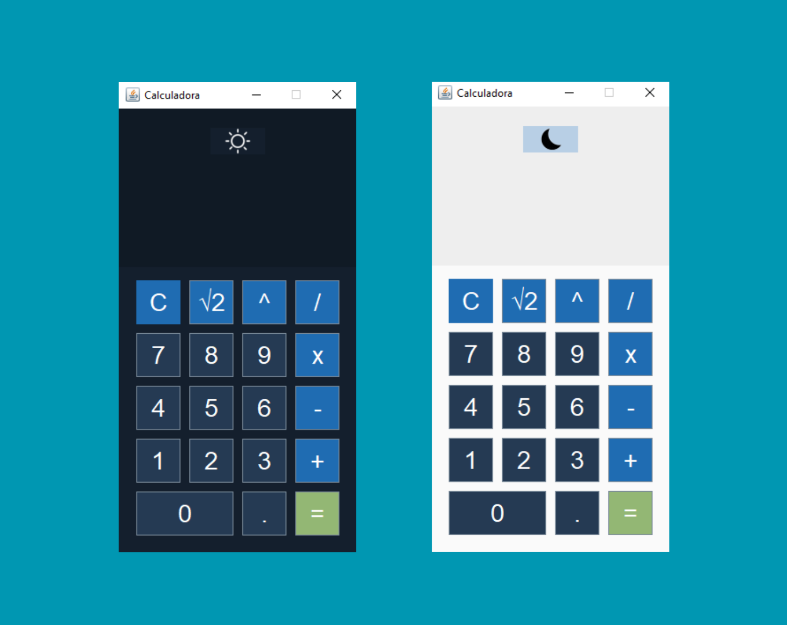

# Calculadora en Java (Maven - NetBeans)

Este es un proyecto de calculadora desarrollado en Java utilizando Maven en NetBeans. La aplicación permite realizar operaciones matemáticas básicas con una interfaz gráfica amigable.

## Características
- Operaciones básicas: suma, resta, multiplicación y división.
- Interfaz gráfica intuitiva.
- Validaciones para evitar errores en las operaciones.
- Diseño responsivo para distintas resoluciones de pantalla.

## Requisitos
- Java 8 o superior
- Apache Maven
- NetBeans (opcional, pero recomendado)

## Instalación y Ejecución
1. Clona este repositorio:
   ```sh
   git clone https://github.com/Cristhian1810/calculadora.git
   ```
2. Navega al directorio del proyecto:
   ```sh
   cd calculadora
   ```
3. Compila el proyecto con Maven:
   ```sh
   mvn clean install
   ```
4. Ejecuta la aplicación:
   ```sh
   mvn exec:java
   ```

## Captura de Pantalla
Aquí puedes ver una vista previa de la calculadora en acción:

